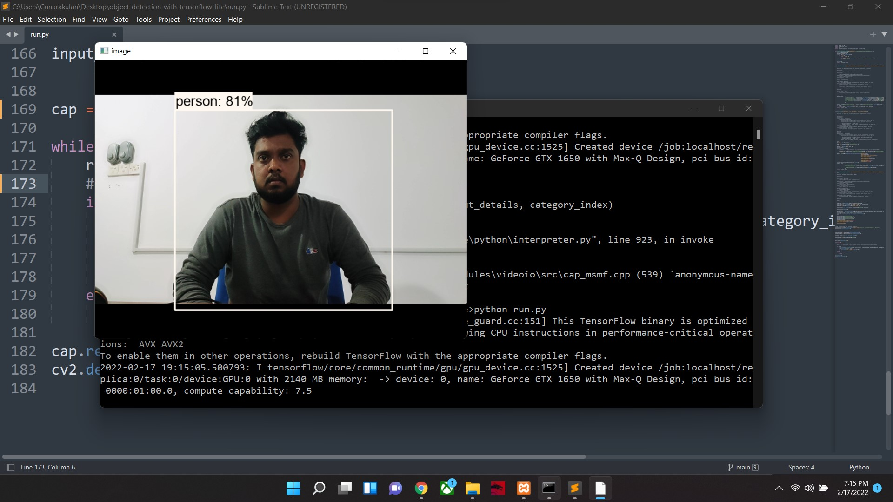

# Object Detection Using TensorFlow Lite

## Introduction

Object detection is a computer technology related to computer vision and image processing that deals with detecting instances of semantic objects of a certain class in digital images and videos.

TensorFlow Lite is Google's machine learning framework to deploy machine learning models on multiple devices and surfaces such as mobile (iOS and Android), desktops and other edge devices.

This repository contains an object detection system that uses the coco_ssd_mobilenet model with TensorFlow Lite.

TensorFlow Lite model could be used to build small computing power AI models. Here, this system can detect 90 objects with lightweight model.


### Programming Languages & Frameworks
- Python
- TensorFlow
- Protobuf
- TensorFlow Object Detection Framework

### Technical Requirements
- Python 3.8
- TensorFlow 2.5

### Installing TensorFlow

Now, It's time to install TensorFlow. It is simple now. Just open CMD and type following command, that will install TensorFlow for both versions including TensorFlow Lite.

- Installing TensorFlow

  ```
    pip install tensorflow
  ```

### Installing Object Detection Framework

In order to install the object detection framework, clone the following repository. This repo contains Google Research of TensorFlow and Object Detection API files and contents.

Clone this Google models repository:- [https://github.com/tensorflow/models](https://github.com/tensorflow/models)

This repo is large (700MB). it contains almost all files of the TensorFlow and Google Object Detection Framework researches, we should install it manually to utilize the object detection framework.

- Clone models repo

  ```
    git clone https://github.com/tensorflow/models.git
  ```


Now, we have to download Protobuf to convert the serialize structured data.


Download Protobuf:- [https://github.com/protocolbuffers/protobuf/releases](https://github.com/protocolbuffers/protobuf/releases)

01.Extract it.

02.Copy the protoc.exe and paste it under the cloned repo (models/research) folder.


- From models/research folder, Execute the following code in CMD

  ```
    protoc object_detection/protos/*.proto --python_out=.
  ```

03.To install the object detection manually, copy the setup.py that is under (models/research/object_detection/packages/tf2/setup.py) and paste in the (models/research) folder.


- Install object detection manually from (models/research).

  ```
    pip install -e .
  ```

04.After the installation, we don't need the cloned models repo anymore.

### Installing Other Frameworks


- Installing TF-Slim

  ```
    pip install tf-slim
  ```

- Installing tf-models-official

  ```
    pip install tf-models-official
  ```

- Installing Mediapipe

  ```
    pip install mediapipe
  ```

- Installing Opencv

  ```
    pip install opencv-python
  ```


## Convert TensorFlow model to TensorFlow Lite model

* [Convert TensorFlow model to TensorFlow Lite](https://www.tensorflow.org/lite/convert)


### Execution & Running

```
 python run.py

```

##### To change video source or webcam.

Note:- We can give the path of the video to process. If we want to use it as a real time webcam. We can simply put the index of the camera

Example:-

```
cap = cv2.VideoCapture(0)

```

Note:- 0 is the first camera, 1 is the second camera and 2,3 and etc.


### Output





# Contact

### Website: 

[](https://www.gunarakulan.info)

### Social Media:

[](https://www.linkedin.com/in/gunarakulangunaretnam)
[](https://www.facebook.com/gunarakulangunaretnam)
[](https://wa.me/94740001141?text=WhatsApp%3A%20%2B9740001141)
[](https://www.instagram.com/gunarakulangunaretnam)
[](https://x.com/gunarakulangr)
[](https://www.kaggle.com/gunarakulangr)
[](https://www.tiktok.com/@gunarakulangunaretnam)
[](https://www.youtube.com/channel/UCjMOdgHFAjAdBKiqV8y2Tww)
